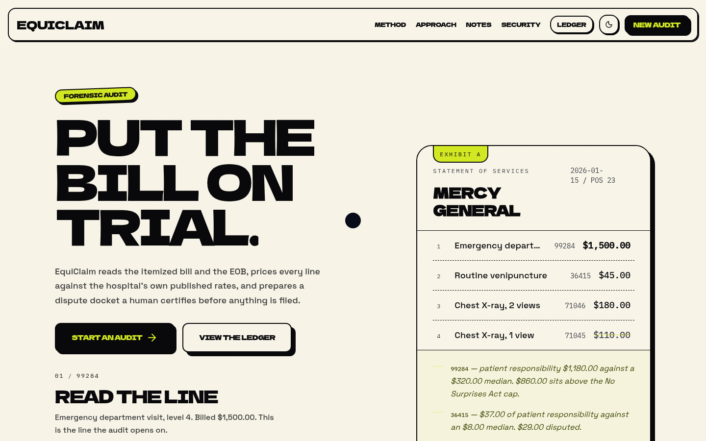
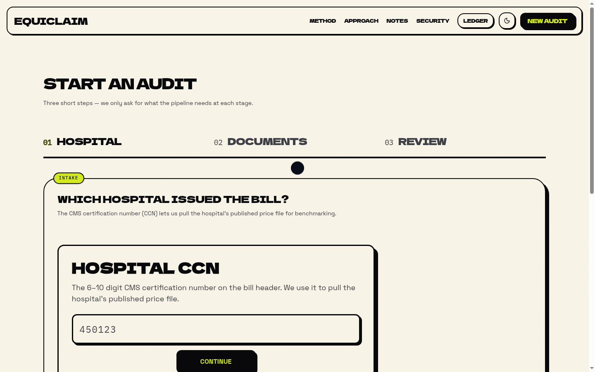
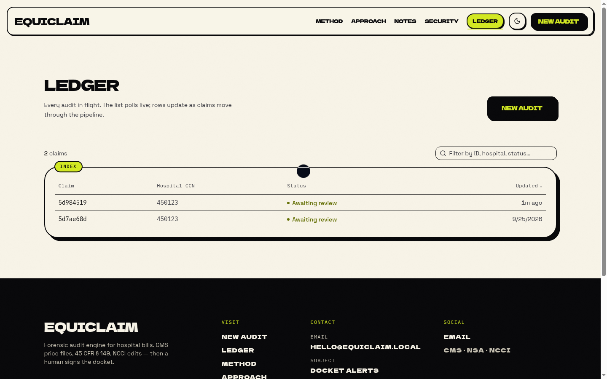
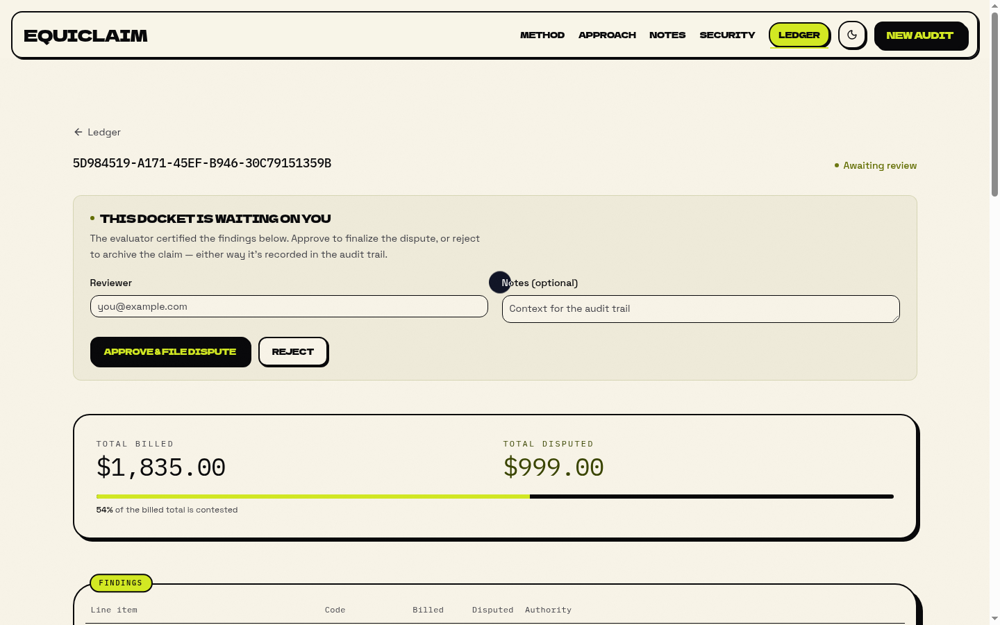
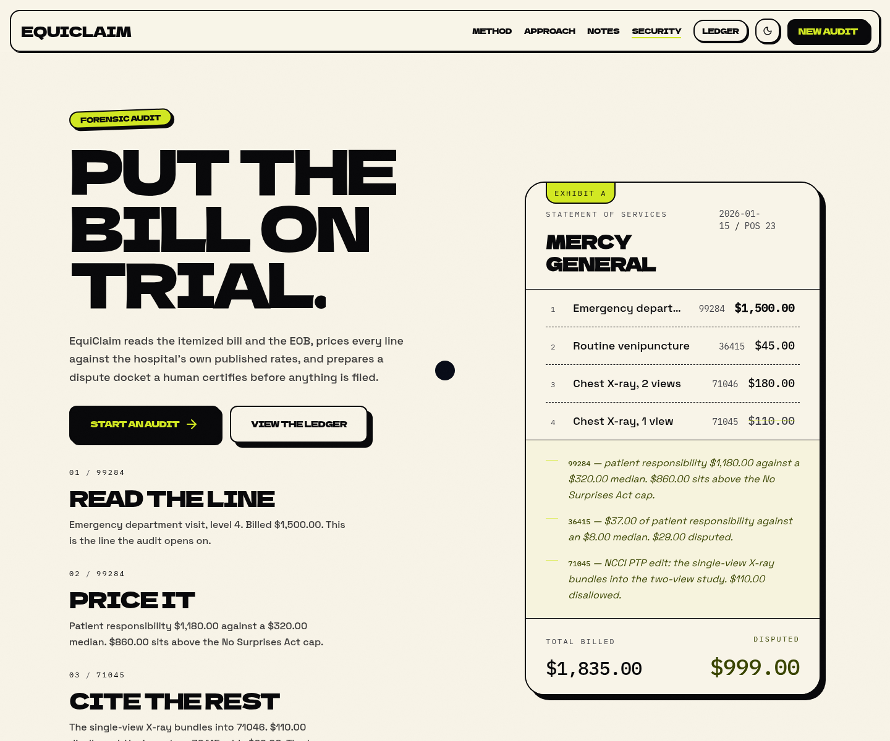
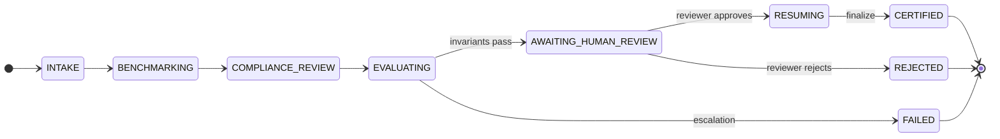
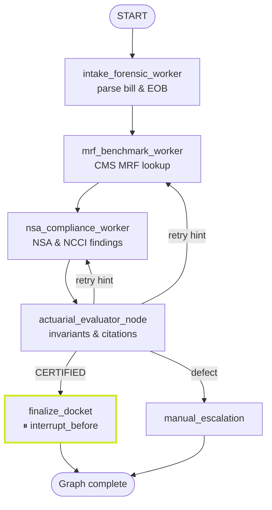
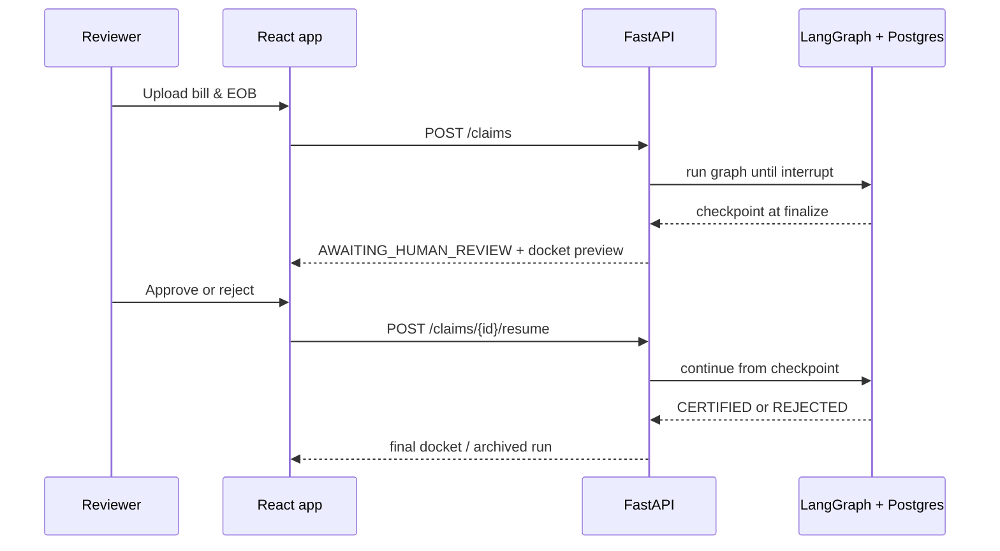
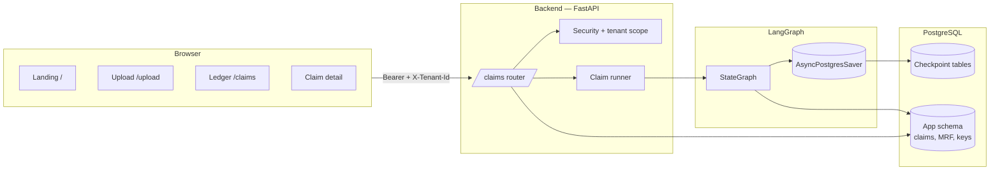

# EquiClaim

**A forensic audit engine for hospital bills — with a human still in the loop.**

Most people never see the line items behind a six-figure ER bill until it’s too late. EquiClaim is software I built to read an itemized bill and EOB the way an analyst would: reconcile the math, compare charges to the hospital’s published CMS price file, check No Surprises Act and NCCI rules, and only then ask a person to certify what should be disputed. The output is an **Audit Docket** — findings tied to real citations — plus a dispute notice you can actually send.

This repo is the full stack: typed data contracts, a LangGraph multi-agent pipeline, a FastAPI backend, and a React front end where reviewers sign off before anything is finalized.

---

## Web showcase

These are real screens from the app (local dev, sample CCN **450123**). The landing page explains the method; the product pages are where uploads become ledger rows and paused dockets.

<p align="center">
  
  <br />
  <em>Landing — sample statement with scroll-linked “read → price → cite” beats and live dispute math.</em>
</p>

<table>
  <tr>
    <td width="50%" valign="top">
      
      <br />
      <em>Upload wizard — CCN, documents, and review; validated with Zod before anything hits the API.</em>
    </td>
    <td width="50%" valign="top">
      
      <br />
      <em>Ledger — TanStack Table + Query polling as claims move through the graph.</em>
    </td>
  </tr>
  <tr>
    <td width="50%" valign="top">
      
      <br />
      <em>Claim detail — graph paused at <code>finalize_docket</code>; reviewer approves or rejects with an audit trail.</em>
    </td>
    <td width="50%" valign="top">
      
      <br />
      <em>Security — what the deployment actually enforces, not marketing filler.</em>
    </td>
  </tr>
</table>

Visual spec (type, color, motion): [`docs/design-system.md`](docs/design-system.md).

---

## What makes EquiClaim different

A lot of “AI bill checker” demos stop at a chat box. EquiClaim is built like infrastructure you could hand to a billing desk — with rules you can cite in writing.

| | Most bill tools | EquiClaim |
|---|---|---|
| **Evidence** | Vague “overcharged” flags | Findings tied to **45 CFR § 149**, **NCCI PTP**, and the hospital’s own **CMS MRF** row |
| **Money** | Floats and rounding drift | **Integer cents** end-to-end; reconciliation checked with zero tolerance |
| **Automation** | One-shot LLM answer | **LangGraph workers** + an evaluator that **re-verifies** workers before a human sees output |
| **Control** | Auto-send or auto-deny | **Hard pause** at finalize; status `AWAITING_HUMAN_REVIEW` until someone certifies |
| **Tenancy** | Shared API key horror | **Per-tenant HMAC keys**, repository-scoped queries, **404** on cross-tenant IDs |
| **Honesty in UI** | Security buzzwords | Landing **#security** matches headers, upload limits, and tests in `test_security.py` |

Under the hood it’s still a web app — but the center of gravity is **deterministic audit logic** (schemas, graph state, SQL), with the UI there to make that logic legible.

---

## Computational skills this project shows best

If you’re skimming for what I actually *did* in code, these are the threads I’d point to first.

### 1. Typed systems & invariant checking

- **Pydantic v2 contracts** for claims, line items, findings, and dockets — `extra="forbid"`, validators on money and citations ([`backend/app/schemas/`](backend/app/schemas/)).
- **Domain layer** for CPT/HCPCS, NCCI PTP pairing, and citation allow-lists ([`backend/app/domain/`](backend/app/domain/)).
- **Dedicated money module** — cents-safe arithmetic without floating-point surprises ([`backend/app/domain/money.py`](backend/app/domain/money.py)).

*Skill:* modeling messy real-world data (healthcare billing) so illegal states are unrepresentable or caught immediately.

### 2. Stateful multi-agent orchestration (not prompt soup)

- **Shared graph state** with explicit reducers: overwrite vs upsert-by-key vs append-only audit fields ([`backend/app/graph/state.py`](backend/app/graph/state.py)).
- **Fixed worker topology** — intake → MRF benchmark → NSA/NCCI → evaluator, with conditional retries and a **fail-closed escalation** path ([`backend/app/graph/graph.py`](backend/app/graph/graph.py)).
- **Postgres checkpoints** via `AsyncPostgresSaver` so pause/resume is durable across process restarts.

*Skill:* designing long-running, resumable workflows where each step has a testable contract.

### 3. Evaluator–optimizer loops with a real stop condition

The evaluator re-runs mathematical and statutory checks independently of the workers ([`backend/app/graph/nodes/evaluator.py`](backend/app/graph/nodes/evaluator.py)):

- line reconciliation in cents  
- QPA vs MRF median caps  
- same-day NCCI modifier-0 pairs  
- citation allow-list + provenance for every disputed cent  

Bounded iterations; then **manual escalation**, not infinite “try again” loops.

*Skill:* building reflection loops that terminate predictably and fail safely.

### 4. Human-in-the-loop as a first-class API

- Graph compiled with `interrupt_before=["finalize_docket"]`.
- Claim statuses **`RESUMING`**, resume **locks**, and orphan-run sweeps on startup ([`backend/app/services/claim_runner.py`](backend/app/services/claim_runner.py), [`backend/tests/test_hardening.py`](backend/tests/test_hardening.py)).
- Frontend certification flow with explicit approve/reject and audit notes ([`frontend/src/pages/ClaimDetailPage.tsx`](frontend/src/pages/ClaimDetailPage.tsx)).

*Skill:* connecting agent frameworks to product UX and backend concurrency rules.

### 5. Data engineering on CMS price files

- MRF ingest with **replace-on-reingest** semantics and stable QPA medians ([`backend/app/ingestion/mrf_ingest.py`](backend/app/ingestion/mrf_ingest.py), [`backend/app/repositories/mrf_repository.py`](backend/app/repositories/mrf_repository.py)).
- Benchmark worker joins claim lines to ingested hospital rates in SQL, not in memory guesses.

*Skill:* joining operational claim data to large, messy regulatory datasets.

### 6. Security-minded backend & honest frontend

- Peppered **HMAC-SHA256** API keys, default-secret refusal outside dev/test ([`backend/app/core/security.py`](backend/app/core/security.py)).
- Upload path sanitization, size caps, suffix-based parsing ([`backend/app/routers/claims.py`](backend/app/routers/claims.py)).
- API security headers + production CSP in nginx; OpenAPI hidden outside dev ([`backend/app/main.py`](backend/app/main.py), [`frontend/nginx.conf`](frontend/nginx.conf)).

*Skill:* threat-modeled defaults for a multi-tenant document API.

### 7. Full-stack product engineering

- **React 19** marketing + app shell with accessible motion fallbacks ([`frontend/src/pages/LandingPage.tsx`](frontend/src/pages/LandingPage.tsx)).
- **TanStack Query** polling with backoff on the ledger; **React Hook Form + Zod** on intake ([`frontend/src/pages/LedgerPage.tsx`](frontend/src/pages/LedgerPage.tsx), [`frontend/src/pages/UploadPage.tsx`](frontend/src/pages/UploadPage.tsx)).
- **56 pytest tests** covering graph pause/resume, evaluator invariants, API hardening, and tenant isolation.

*Skill:* shipping one coherent product, not a notebook beside a mockup.

---

## At a glance

| | |
|---|---|
| **Input** | Hospital CCN, bill + EOB (JSON or plain text) |
| **Benchmark** | CMS Hospital Price Transparency (MRF) rates for that facility |
| **Rules** | 45 CFR § 149 (NSA), NCCI PTP edits, CARC/RARC denial mapping |
| **Output** | Statute-cited findings, disputed amounts in integer cents, certified docket |
| **Guardrail** | Graph **pauses** before finalize — no docket ships without human approval |

---

## How a claim moves through the system

From upload to certification, status is visible in the ledger and on the claim detail page.



The names map directly to graph workers and API responses — there’s no hidden “processing” black box.

---

## The agent pipeline (LangGraph)

EquiClaim isn’t a single prompt. It’s a **fixed topology** of workers that share one checkpointed state (`EquiClaimState` in Postgres). An actuarial evaluator re-checks math and citations; if something still fails after bounded retries, the run stops at **manual escalation** instead of looping forever.



**Human-in-the-loop:** compilation uses `interrupt_before=["finalize_docket"]`. The graph saves a checkpoint, the API returns `AWAITING_HUMAN_REVIEW`, and the UI shows findings and the draft notice. A reviewer approves or rejects; only then does `resume` run finalize and emit the certified docket.



---

## Architecture



**Money is integer cents everywhere** — Pydantic models and domain helpers enforce that before findings ever reach the evaluator.

---

## What the evaluator actually checks

Before the human ever sees a docket, the evaluator treats the workers as untrusted and re-verifies:

| Category | Examples |
|---|---|
| **Math** | Line reconciliation (`billed = allowed + adjustments + patient responsibility`), non-negative amounts |
| **Benchmarks** | QPA / MRF median caps on emergency and out-of-network lines |
| **Edits** | NCCI modifier-0 PTP pairs on the same date |
| **Law & provenance** | Citations against an allow-list; every disputed cent traces to MRF or denial mapping |

If the loop exhausts its iteration budget, the claim **fails closed** — it does not auto-certify with a shrug.

---

## Stack

| Layer | Choices |
|---|---|
| **Frontend** | React 19, Vite, Tailwind CSS 4, shadcn/ui, TanStack Query & Table, React Hook Form + Zod, Motion |
| **API** | FastAPI, Pydantic v2, structured request logging (`X-Request-Id`) |
| **Agents** | LangGraph `StateGraph`, evaluator–optimizer routing, Postgres checkpoints |
| **Database** | PostgreSQL — app migrations + `langgraph-checkpoint-postgres` |
| **Tooling** | `uv` + `pytest` / `ruff` / `mypy` (backend); `npm` + `tsc` / `oxlint` (frontend) |

The graph topology and schemas live in code, not in a slide deck: start with [`backend/app/graph/graph.py`](backend/app/graph/graph.py) and [`backend/app/graph/state.py`](backend/app/graph/state.py).

---

## Try it locally

**1. Environment**

```bash
cp .env.example backend/.env
cp .env.example frontend/.env
# Set VITE_API_BEARER_TOKEN / VITE_TENANT_ID to match backend dev settings
```

**2. Postgres** — tests and the API expect a database on `localhost:5432` (Docker Compose or Podman both work):

```bash
docker compose up postgres -d
# or: podman start equiclaim-postgres
```

**3. Backend & frontend**

```bash
cd backend && uv sync && uv run uvicorn app.main:app --reload
cd frontend && npm install && npm run dev
```

Or run everything with hot reload:

```bash
docker compose up --build
```

| Service | URL |
|---|---|
| API | http://localhost:8000 (`/healthz`; `/docs` in development only) |
| App | http://localhost:5173 |

On a fresh DB, development startup seeds sample MRF data for hospital CCN **450123**. The upload page’s **Load sample bill & EOB** uses the same CCN so you can walk through a full audit without manual ingest. Other facilities need an MRF loaded first:

```bash
cd backend && uv run python -m app.ingestion.mrf_ingest --help
```

---

## Interface (routes)

| Route | Role |
|---|---|
| `/` | Landing: what EquiClaim checks, sample annotated statement, security notes |
| `/upload` | Three-step intake (hospital → documents → review) |
| `/claims` | Sortable ledger with live status |
| `/claims/:id` | Findings, notice preview, certification dialog |

Accessibility: skip link, landmarks, stepper `aria-current`, focus rings, and `prefers-reduced-motion` paths on the marketing motion.

---

## Security & tenancy (short version)

- Every `/claims` call needs `Authorization: Bearer …` and, in dev/test, an explicit `X-Tenant-Id`.
- Production keys are **HMAC-SHA256 + pepper** per tenant — one leaked key doesn’t poison the whole install.
- Repositories always filter by `tenant_id`; cross-tenant IDs get **404**, not a peek at someone else’s claim.
- API responses ship security headers; OpenAPI is hidden outside development/test; nginx serves a strict CSP in production builds.

Details and tests: [`backend/tests/test_security.py`](backend/tests/test_security.py).

---

## Tests

Postgres must be running (`EQUICLAIM_DATABASE_URL` in `backend/.env`). Migrations apply on startup; LangGraph creates its own checkpoint tables.

```bash
cd backend
uv run pytest          # schemas, graph pause/resume, evaluator, API, auth
uv run ruff check .
uv run mypy app

cd frontend
npm run build          # tsc + vite production bundle
npm run lint
```

When everything is wired up, you should see on the order of **56** backend tests pass — the suite is how I lock in regressions on money, resume locks, and tenant isolation.

---

## Production-shaped deploy

[`docker-compose.prod.yml`](docker-compose.prod.yml) layers immutable images, no bind mounts, backend without `--reload`, and the frontend built to static files behind nginx.

```bash
docker compose -f docker-compose.yml -f docker-compose.prod.yml up -d --build
```

Keep secrets (`EQUICLAIM_DATABASE_URL`, `EQUICLAIM_API_KEY_PEPPER`, tenant keys) in the environment — never in the image.

---

## Repository map

```
backend/
  app/schemas/     Pydantic contracts (cents, validators)
  app/graph/       State, reducers, nodes, compiled graph
  app/routers/     Claims API — upload, status, resume, docket
  migrations/      SQL schema (incl. RESUMING, tenant keys, MRF medians)
  tests/           pytest — pipeline, hardening, security
frontend/
  src/pages/       Landing, upload wizard, ledger, claim detail
  src/components/  site/ + ui/ + review & docket viewers
docs/
  design-system.md Visual and motion spec
  screenshots/     README showcase captures
```

---

## Why I built this

Hospital billing errors aren’t abstract — they show up as surprise balances, denied appeals, and hours on hold. I wanted a project that combined **real regulation** (CMS files, NSA, NCCI), **real software engineering** (typed state, checkpointed agents, tenant-safe APIs), and **real humility** (automation stops; a person certifies). EquiClaim is that experiment, end to end, in one repo you can run, test, and break.

If you’re reviewing this for admissions or a portfolio: clone it, start Postgres, hit **Load sample bill & EOB**, and watch the graph pause when it’s your turn to decide. The screenshots above are what you should see on the way there.

---

<p align="center">
  <sub>Built with care for people who shouldn’t have to decode a bill alone.</sub>
</p>
