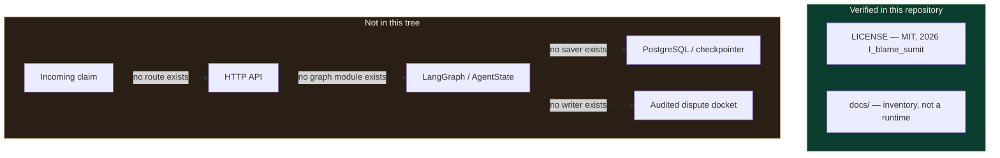

# EquiClaim

<p align="center">
  <strong>A public home for an insurance-denial project that is not yet in this tree.</strong><br />
  Named as an autonomous cross-examination engine for denial adjudication<br />
  and hospital price-transparency work — <em>intent only, until source lands here</em>.
</p>

<p align="center">
  
  
  
  
</p>

<p align="center">
  <a href="#why-this-exists">Why this exists</a> ·
  <a href="#what-is-actually-in-this-repository">What is in the repo</a> ·
  <a href="docs/ARCHITECTURE.md">Architecture</a> ·
  <a href="docs/state_diagram.md">State diagram</a> ·
  <a href="docs/sequence_diagram.md">Sequence diagram</a> ·
  <a href="#setup">Setup</a>
</p>

---

A denial letter is a small piece of paper that can swallow a year of someone's life.

I keep thinking about the person who already sat in the waiting room, already paid the copay they could afford, already believed the hospital and the plan were talking to each other — and then gets a bill that reads like a locked door. Not a conversation. A verdict. If you have never watched a family try to decode CARC codes at a kitchen table while the collections clock runs, it is easy to treat this as a "workflow problem." It is not. It is a person being asked to cross-examine an industry that writes the evidence in a language they were never taught.

**EquiClaim** is the name I put on the work I want to do about that. The GitHub repository title, and the brief this documentation was written against, call it an *Autonomous Cross-Examination Engine for Insurance Denial Adjudication and Hospital Price Transparency Compliance*. That sentence is a **north star**, not a changelog. I will not pretend the engine is compiled here when it is not.

This README is written for two rooms at once: the admissions or STS/ISEF reader who cares whether the civic wound is real, and the engineer or faculty member who will open the file tree before they trust a single badge. Both deserve the same sentence.

> As of commit [`b772ac6`](https://github.com/sumit-sh2009/EquiClaim/commit/b772ac63fdff714449060902538f1088df308f58) (`Initial commit`, 2026-09-13), the only application artifact on `main` is [`LICENSE`](LICENSE). There is no API, no LangGraph graph, no frontend, no schema, and nothing to start.

That is an uncomfortable first line for a portfolio README. It is also the only honest one. I would rather a senior engineer close this tab respecting the inventory than finish it believing in endpoints I invented.

---

## Why this exists

Hospital price transparency and the No Surprises Act exist because the default in American care is opacity. Patients are expected to appeal denials with less information than the payer used to write them. Machine-readable files, Medicare Physician Fee Schedule rows, NCCI edits, CARC/RARC reason codes — those names show up in policy PDFs and in late-night Reddit threads, and almost nowhere in a form a scared person can actually use.

I want software that sits on the patient's side of that table: that reads a denial the way a careful adversary would, that refuses to hallucinate a statute, and that leaves an audit trail a human can take to a regulator or a lawyer.

**That software is not in this repository yet.** The civic problem is. I am documenting the repo as it stands so that when source arrives, the documentation has to change *because the code did* — not the other way around.

---

## What is actually in this repository

Inspected 2026-09-13 against `origin/main` at `b772ac6`, GitHub contents API for `sumit-sh2009/EquiClaim`, and a full local file-tree walk of `/workspace`.

| Path | Kind | What it does |
| --- | --- | --- |
| [`LICENSE`](LICENSE) | MIT text | Grants use/copy/modify/distribute rights; copyright `2026 I_blame_sumit`; no warranty. |
| [`README.md`](README.md) | Documentation | This file. |
| [`docs/ARCHITECTURE.md`](docs/ARCHITECTURE.md) | Documentation | Engineer/faculty deep-dive and negative inventory. |
| [`docs/state_diagram.md`](docs/state_diagram.md) | Documentation | Mermaid state diagram of **verified** states only. |
| [`docs/sequence_diagram.md`](docs/sequence_diagram.md) | Documentation | Mermaid sequence of what happens if you try to run a claim today. |

```text
EquiClaim/
├── LICENSE
├── README.md
└── docs/
    ├── ARCHITECTURE.md
    ├── state_diagram.md
    └── sequence_diagram.md
```

Searched and **not present** (complete list of the usual homes, not a sample):

- `models.py`, `schemas.py`, `types.ts`, or any other Pydantic / ORM / TS schema
- FastAPI / Express / Flask / Next route modules
- LangGraph `StateGraph`, `add_node`, `add_edge`, or an `AgentState` TypedDict
- `requirements.txt`, `pyproject.toml`, `package.json`, `Pipfile`, `poetry.lock`
- `.env.example`, `docker-compose.yml`, `Dockerfile`, Alembic / Prisma migrations
- tests, CI workflows, application configs

If a later commit adds any of those files, treat this README as stale until it is rewritten against that commit.

---

## Architecture (verified)

There is no runtime architecture. The only durable contract in the tree is the MIT license.



Dashed nodes are **absences**, not features. See [`docs/ARCHITECTURE.md`](docs/ARCHITECTURE.md) for the search that produced this picture, and the two Mermaid files for the only diagrams that match the code (which is to say: match the lack of it).

---

## Tech stack

No dependency manifest exists, so there is no version table that would survive a careful read.

| Layer | Version in repo | Source |
| --- | --- | --- |
| License | MIT, copyright 2026 `I_blame_sumit` | [`LICENSE`](LICENSE) |
| Language runtime | *[NOT VERIFIED IN CODE — confirm before publishing]* | no `runtime.txt` / `.python-version` / `engines` field |
| Web framework | *[NOT VERIFIED IN CODE — confirm before publishing]* | no route module, no framework pin |
| Agent graph | *[NOT VERIFIED IN CODE — confirm before publishing]* | no LangGraph (or any other) graph definition |
| Database / checkpointer | *[NOT VERIFIED IN CODE — confirm before publishing]* | no ORM, no `DATABASE_URL` reader, no saver |
| Frontend | *[NOT VERIFIED IN CODE — confirm before publishing]* | no `package.json` |

I am not going to badge this repo as FastAPI + LangGraph + Postgres because those words appear in a product sentence. They do not appear in a lockfile.

---

## Environment variables

No `.env.example` and no `os.environ` / `process.env` readers exist in this tree.

| Variable | Required | Purpose |
| --- | --- | --- |
| — | — | *[NOT VERIFIED IN CODE — confirm before publishing]* |

If you find an env var named in a future module, add it here with the file path. Do not copy a list from another project.

---

## API surface

No HTTP application is defined. There are **zero** verified endpoints.

| Method | Path | Notes |
| --- | --- | --- |
| — | — | *[NOT VERIFIED IN CODE — confirm before publishing]* |

A claim cannot be posted. A docket cannot be fetched. Those sentences are about this commit, not about the problem.

---

## Setup

You can clone the public home of the project. You cannot boot an engine that is not here.

### Prerequisites

Git. That is the only prerequisite implied by the files that exist.

### Clone

```bash
git clone https://github.com/sumit-sh2009/EquiClaim.git
cd EquiClaim
git checkout main
git log -1 --oneline
# expect: b772ac6 Initial commit   (until main moves)
```

### What you can run

```bash
# inventory — this is the whole application surface today
find . -type f -not -path './.git/*' | sort
```

There is no `pip install`, no `npm install`, no migrate step, and no dev server. Any command that assumes those exists is documenting a different repository.

### What you should not do

- Do not add a fake `requirements.txt` so the README looks finished.
- Do not paste LangGraph node names from another denial-appeal demo and call them EquiClaim.
- Do not tell an admissions reader that MRF / PFS / NCCI / CARC ingestion is implemented. Those acronyms are **domain vocabulary**, not modules in this tree.

---

## Trade-offs I am choosing on purpose

**Document the hole instead of furnishing it.** A beautiful invented architecture would read well for thirty seconds and fail the first `ls`. I care more about the person who will one day trust this project with a real denial than I care about looking further along than I am.

**Keep the civic sentence visible.** Honesty about the empty tree is not the same as pretending the problem is empty. Families are still opening those envelopes. The No Surprises Act and hospital MRF rules still exist in public law whether or not I have a parser.

**Make the next commit expensive in the right way.** When application source arrives, these four files must be rewritten against *that* tree: real node names, real routes, real pins from `requirements.txt` / `package.json`, real env vars from `.env.example`. Until then, every technical claim stays in the "not verified" column.

The failure mode of this stance is obvious: a reviewer looking for a running demo will not find one. That is a real cost. The failure mode of the other stance — inventing an engine — is worse. It would be a lie told in the same breath as "I built this for patients."

---

## Documentation map

| File | Audience | Promise |
| --- | --- | --- |
| [`README.md`](README.md) | Anyone | Civic why, verified inventory, how to clone, what not to claim. |
| [`docs/ARCHITECTURE.md`](docs/ARCHITECTURE.md) | Engineers / faculty | Negative inventory, license contract, what will be written when code exists. |
| [`docs/state_diagram.md`](docs/state_diagram.md) | Graph readers | `stateDiagram-v2` of verified repository states. No invented LangGraph nodes. |
| [`docs/sequence_diagram.md`](docs/sequence_diagram.md) | API readers | Claim → docket **cannot** complete; the sequence stops at "no route." |

---

## Status and how to update this

| Fact | Value | Source |
| --- | --- | --- |
| Remote | `https://github.com/sumit-sh2009/EquiClaim` | `git remote` |
| Default branch | `main` | `origin/HEAD` |
| Branches on origin at audit | `main` only | GitHub `list_branches` |
| Application commits | one: `b772ac6` | `git log` |
| Issues / PRs at audit | none | GitHub issues / PR search |

When you add source, do not append a "coming soon" paragraph. Replace the tables. Point every endpoint and every graph node at a file. If you cannot point, keep the `[NOT VERIFIED IN CODE — confirm before publishing]` label. That label is not decoration. It is the difference between a portfolio and a brochure.

---

## License

MIT. Copyright (c) 2026 `I_blame_sumit`. See [`LICENSE`](LICENSE).

The license is the one thing in this repository that already speaks for itself: the work, when it exists, is meant to be shared. I would like the first shared thing to be true.
