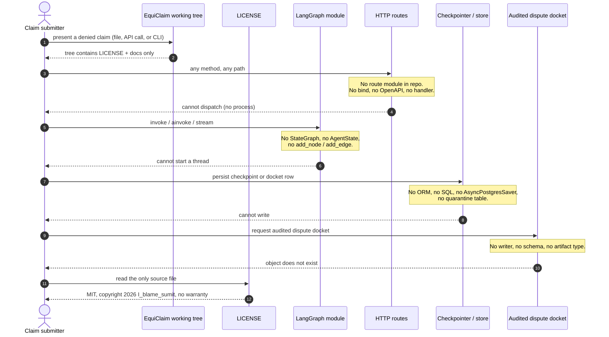

# EquiClaim sequence diagram

Requested story: **incoming claim → audited dispute docket**.

Verified story: **incoming claim → no HTTP application → no graph → no docket**.

This file draws the verified story. A sequence that continued through imagined routes (`POST /claims`, `graph.ainvoke`, `INSERT INTO dockets`) would cite files that do not exist.

**Searched:** local tree and `sumit-sh2009/EquiClaim@b772ac6` for route definitions, OpenAPI, and LangGraph invoke/stream calls. **None found.**

---

## 1. Incoming claim, as the repository actually behaves

A patient, clinic, or test harness that tries to submit a denial packet against this clone meets the filesystem, not a service.



The docket is not "pending." It is **undefined**. Treating "undefined" as an empty JSON document would be another invention.

---

## 2. Documentation audit sequence (what produced these files)

This is the sequence that *did* run: a reader walking the real tree so the four docs would not lie.

```mermaid
sequenceDiagram
    autonumber
    actor Auditor as Documentation pass
    participant Git as git / GitHub API
    participant Tree as File tree
    participant Search as Symbol / filename search
    participant Docs as README + docs/*

    Auditor->>Git: log, ls-tree, list_branches, contents of /
    Git-->>Auditor: one commit on main, file LICENSE only

    Auditor->>Tree: walk /workspace excluding .git
    Tree-->>Auditor: LICENSE

    Auditor->>Search: models.py, schemas.py, types.ts
    Search-->>Auditor: absent

    Auditor->>Search: StateGraph, AgentState, AsyncPostgresSaver
    Search-->>Auditor: absent

    Auditor->>Search: route modules, requirements.txt, package.json, .env.example
    Search-->>Auditor: absent

    Auditor->>Docs: write inventory, empty version tables, labeled gaps
    Docs-->>Auditor: four files; no invented endpoints or node names
```

---

## 3. The sequence that must not be published as fact

The following participants are **domain nouns from the project brief**, not types in this repo. They are listed so a later author does not "fill them in" from memory.

| Participant | In brief | In code |
| --- | --- | --- |
| Incoming claim | yes (documentation request) | *[NOT VERIFIED IN CODE — confirm before publishing]* |
| HTTP intake route | implied by "routes" | *[NOT VERIFIED IN CODE — confirm before publishing]* |
| LangGraph thread | implied by "graph flow" | *[NOT VERIFIED IN CODE — confirm before publishing]* |
| MRF / PFS / NCCI / CARC lookup | implied by domain | *[NOT VERIFIED IN CODE — confirm before publishing]* |
| Audited dispute docket | yes (documentation request) | *[NOT VERIFIED IN CODE — confirm before publishing]* |

A future mermaid that uses those participants must cite, on the same page, the route path, the graph node that writes the docket, and the schema type of the docket. If any of those three citations is missing, keep the sequence in section 1.

---

## 4. Replacement template (do not fill until files exist)

When routes and a graph exist, replace section 1 with a diagram whose every arrow is backed by a path:

1. Client → `METHOD /exact/path` (file:line of the route decorator).
2. Handler → `graph.ainvoke` / `astream` (file:line).
3. Each node in **call order**, using the `add_node` name, not a marketing synonym.
4. Conditional branches labeled with the function passed to `add_conditional_edges`.
5. Persistence: checkpointer class and table/collection name from DDL or saver setup.
6. Response: the Pydantic / TS type returned to the client as the docket.

Until those line citations exist, do not draw that chain.
