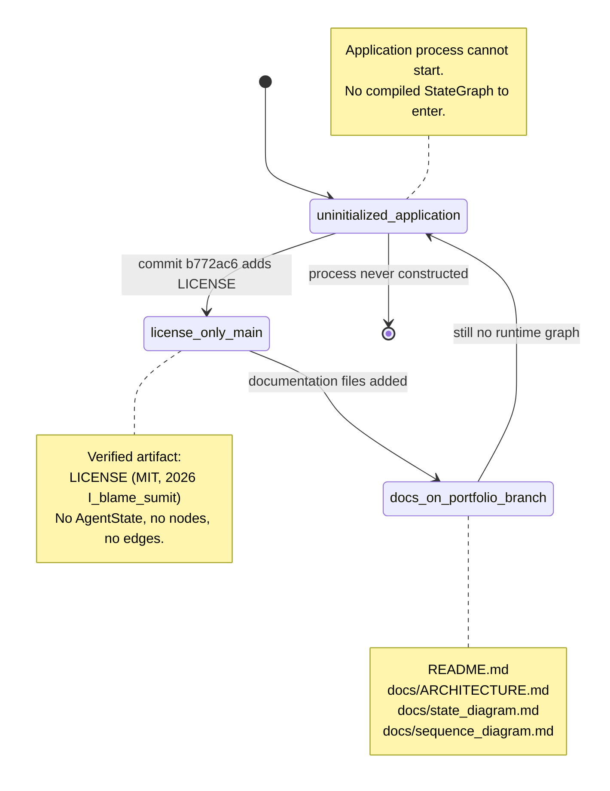
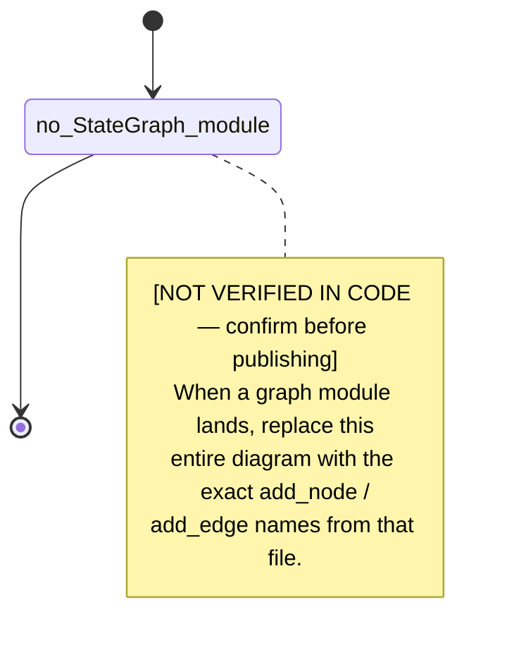

# EquiClaim state diagram

Mermaid `stateDiagram-v2` drawn from **this repository's verified states**, not from a generic agent diagram.

**Source of truth for "is there a LangGraph?"**  
Full-tree search of `/workspace` and GitHub `sumit-sh2009/EquiClaim@b772ac6` for `StateGraph`, `add_node`, `add_edge`, `add_conditional_edges`, `AgentState`, `TypedDict`, `langgraph`. **Zero matches** in application source. The only files that mention those words after this documentation commit are the docs themselves, describing the absence.

Therefore this file **must not** invent node ids (`intake`, `triage`, `advocate`, `scrutinizer`, `emit_docket`, …). A diagram that used those names would be a fiction with a mermaid fence around it.

---

## 1. Why there is no adjudication graph

A LangGraph state diagram is a picture of `add_node` and `add_edge` calls. Those calls are not in the tree. Rendering a plausible cross-examination pipeline would violate the documentation rule: *use THESE (code) names, not a generic AI-agent diagram*.

The honest substitute is the state machine that **does** exist: git + license + the fact that no application process can leave `uninitialized`.

---

## 2. Verified state machine

### State catalog (all names are documentation labels for git/repo facts, not LangGraph node names)

| State | Meaning | Evidence |
| --- | --- | --- |
| `uninitialized_application` | No ASGI/CLI/worker process can be constructed from the tree. | No entrypoint module. |
| `license_only_main` | Default branch history begins with MIT text only. | `git show b772ac6 --stat` → `LICENSE` only. |
| `docs_on_portfolio_branch` | Portfolio documentation exists beside the license. | this file and siblings. |

There is no edge labeled `invoke_graph` or `checkpoint_write` because those transitions have no implementing function.

---

## 3. LangGraph overlay — not in code

The following diagram is the **empty graph**: start and end with nothing in between. It is what a compiler would see if asked to draw EquiClaim's `StateGraph` today.

Do not expand `no_StateGraph_module` into a chain of roles. Expansion without a source file is invention.

---

## 4. How to replace this file when a graph exists

1. Open the module that constructs the graph.
2. List every `add_node("<name>", ...)` — those strings become the states.
3. List every `add_edge("A", "B")` — those become solid transitions.
4. List every `add_conditional_edges` map — those become guarded transitions; quote the predicate name from code.
5. If a checkpointer is passed to `compile(...)`, add a note citing the saver class and the file. Do not assume `AsyncPostgresSaver`.
6. Delete section 2's "uninitialized" machine or move it to an appendix; it will no longer be the primary graph.

Until step 2 has at least one real name, this file stays empty in the middle on purpose.
